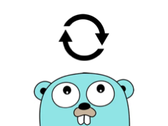

# go-retry

[](https://pkg.go.dev/github.com/tiagomelo/go-retry)



A robust, flexible Go package that provides configurable retry strategies for functions. This package helps you implement retries with different backoff strategies, including handling fatal errors that immediately stop retries.

## Features
- **Retry Strategies**:
  - Linear Backoff: retries at regular intervals, increasing linearly with each attempt. Useful for predictable workloads with consistent retry intervals.
  - Exponential Backoff: retries with exponentially increasing intervals, helping to reduce load on systems during periods of high contention or failure.
  - Randomized Backoff: adds a random delay to each retry interval to avoid thundering herd problems, where multiple clients retry at the same time.
  - Constant Backoff: retries at a fixed interval for all attempts, providing a simple and consistent retry strategy.
- **Fatal Error Handling**: Stop retries immediately upon encountering a fatal error.
- **Examples Included**: See how to use different strategies in [examples](./examples/) folder.

## Installation

```bash
go get github.com/tiagomelo/go-retry
```

## Usage

### Import the package

```go
import "github.com/tiagomelo/go-retry"
```

### Basic Usage

Here’s a simple example using **LinearBackoff**:

```go
package main

import (
	"errors"
	"fmt"
	"time"

	"github.com/tiagomelo/go-retry"
)

func main() {
	strategy := retry.NewLinearBackoff(500*time.Millisecond, 2*time.Second, 5)

	attempts, err := retry.Do(func() error {
		fmt.Println("Attempting operation...")
		return errors.New("temporary error")
	}, strategy)

	fmt.Printf("Completed after %d attempts. Error: %v\n", attempts, err)
}
```

## Examples

Examples for all retry strategies are available in the [examples](./examples/) directory.

### Running Examples

To run the examples:

1. Clone the repository:
   ```bash
   git clone https://github.com/tiagomelo/go-retry.git
   cd go-retry
   ```

2. Navigate to the `examples/` folder:
   ```bash
   cd examples
   ```

3. Run an example:
   ```bash
   go run constant/main.go
   ```

### Example Scenarios

#### Linear Backoff Example
`examples/linear/main.go`
```go
package main

import (
	"errors"
	"fmt"
	"time"

	"github.com/tiagomelo/go-retry"
)

func main() {
	strategy := retry.NewLinearBackoff(500*time.Millisecond, 2*time.Second, 5)

	fmt.Println("=== case 1: retryable error, eventually succeeds ===")
	attempts, err := retry.Do(func() error {
		fmt.Println("attempting operation...")
		return errors.New("temporary error")
	}, strategy)

	fmt.Printf("completed after %d attempts. Error: %v\n\n", attempts, err)

	fmt.Println("=== case 2: fatal error stops retries ===")
	var count int
	attempts, err = retry.Do(func() error {
		count++
		fmt.Println("attempting operation...")
		if count == 3 {
			return retry.EndRetry(errors.New("fatal error"))
		}
		return errors.New("temporary error")
	}, strategy)

	fmt.Printf("completed after %d attempts. Error: %v\n", attempts, err)
}
```

Similar examples exist for:
- **Exponential Backoff**: [`examples/exponential/main.go`](./examples/exponential/main.go)
- **Randomized Backoff**: [`examples/randomized/main.go`](./examples/randomized/main.go)
- **Constant Backoff**: [`examples/constant/main.go`](./examples/constant/main.go)

## Contributing

Contributions are welcome! Feel free to open issues or submit pull requests to enhance the package.

## License

This project is licensed under the MIT License. See the [LICENSE](LICENSE) file for details.